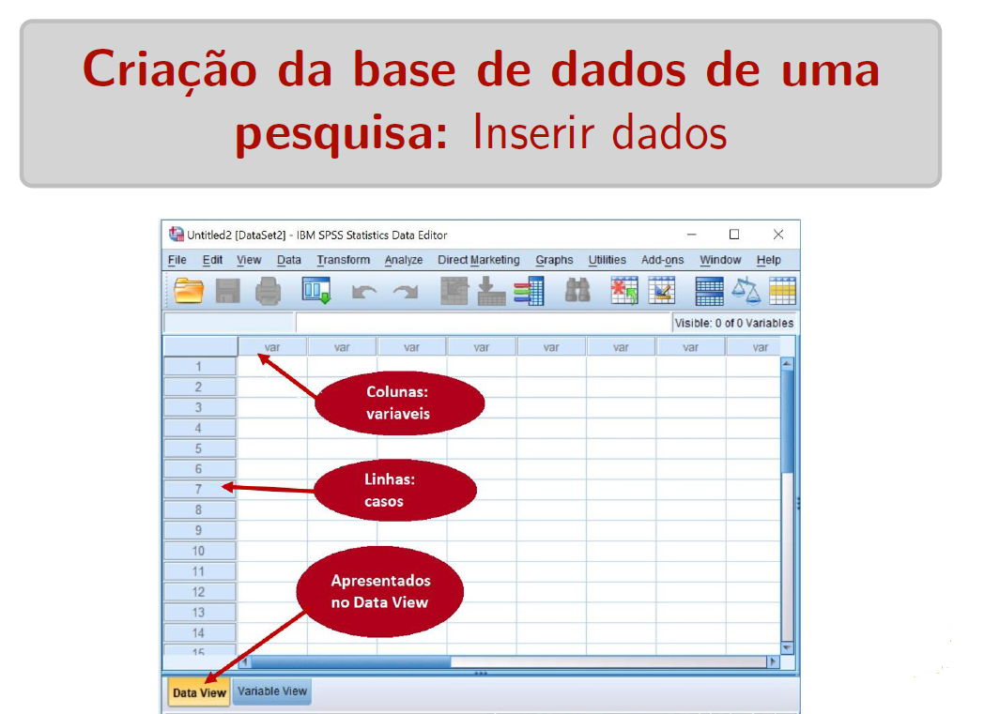
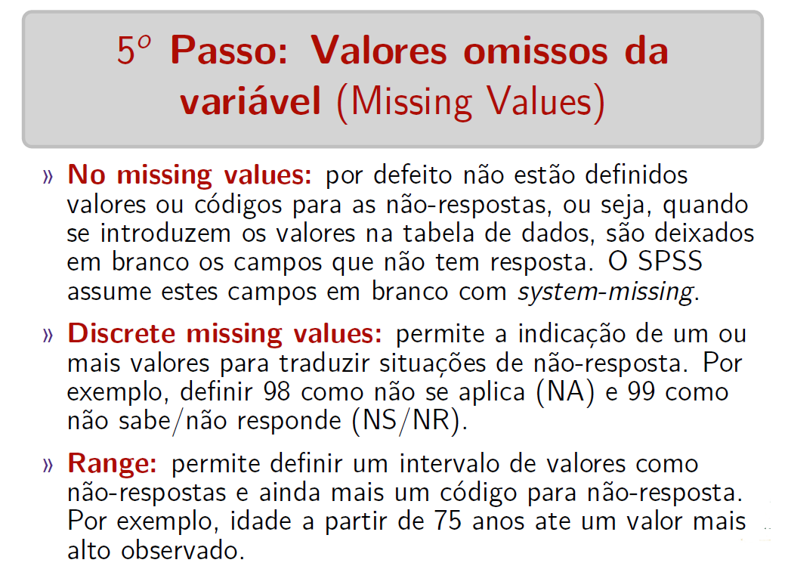
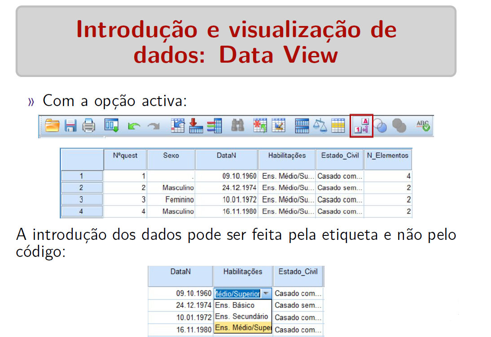
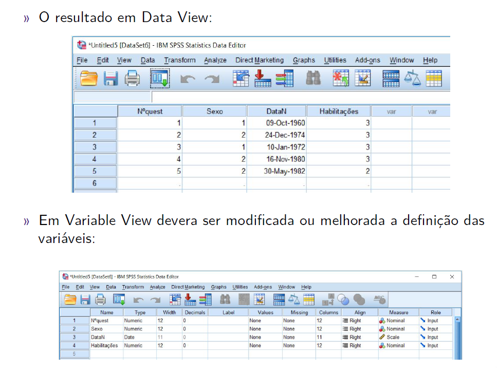
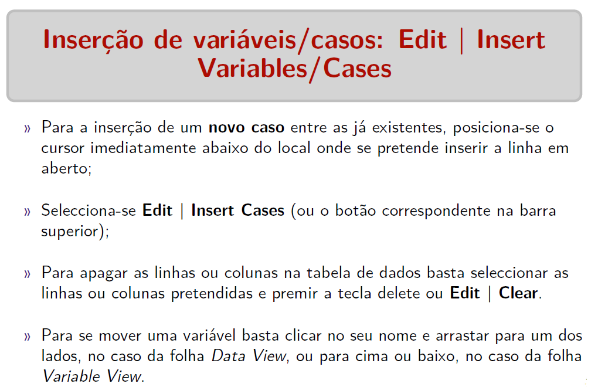
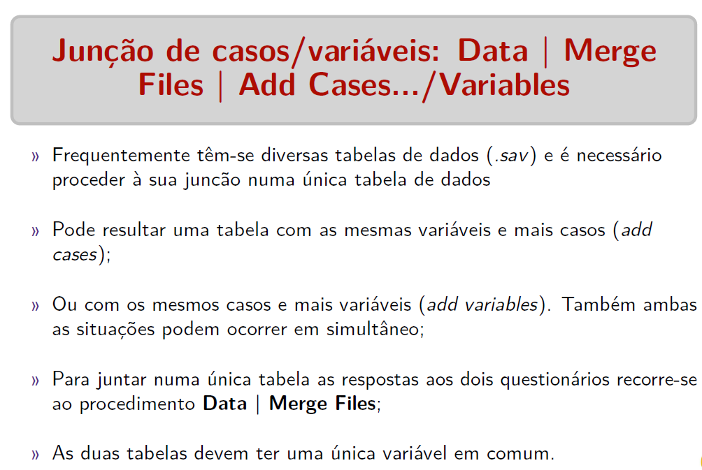
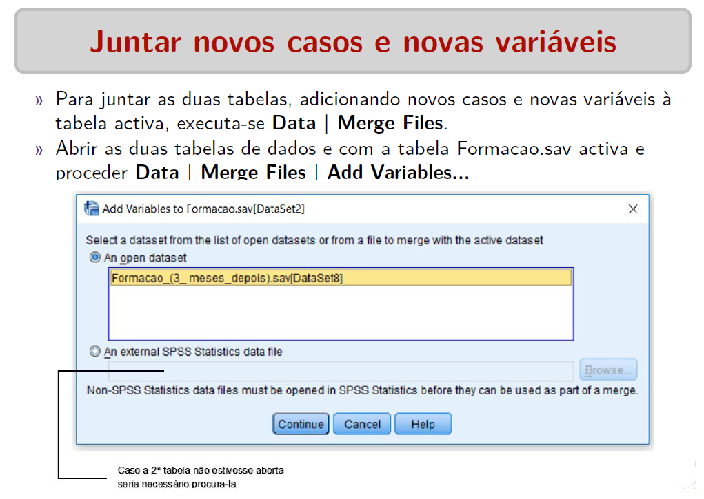
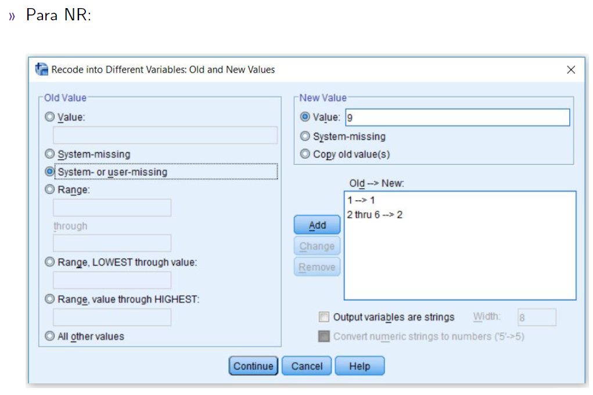
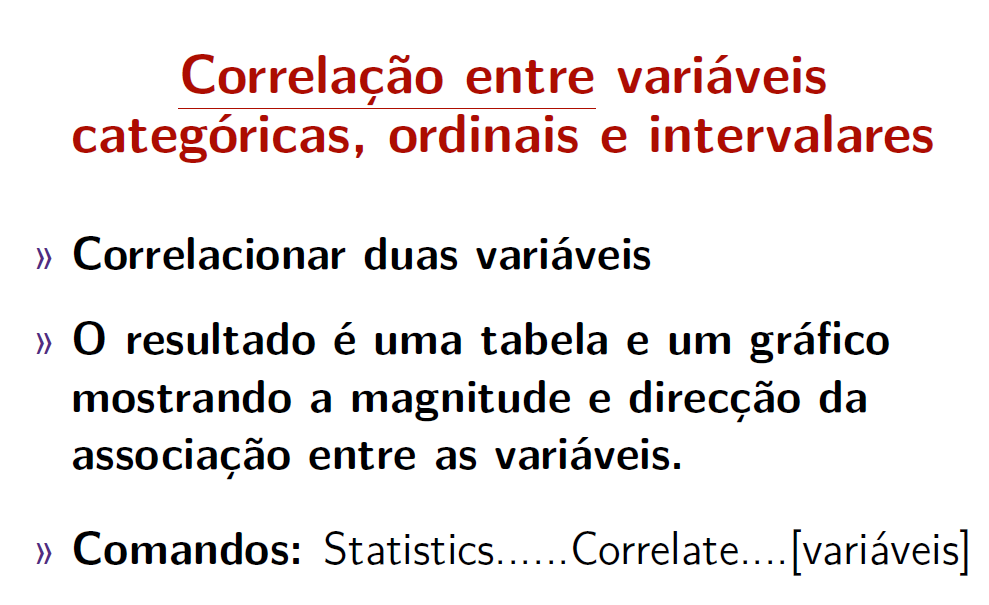
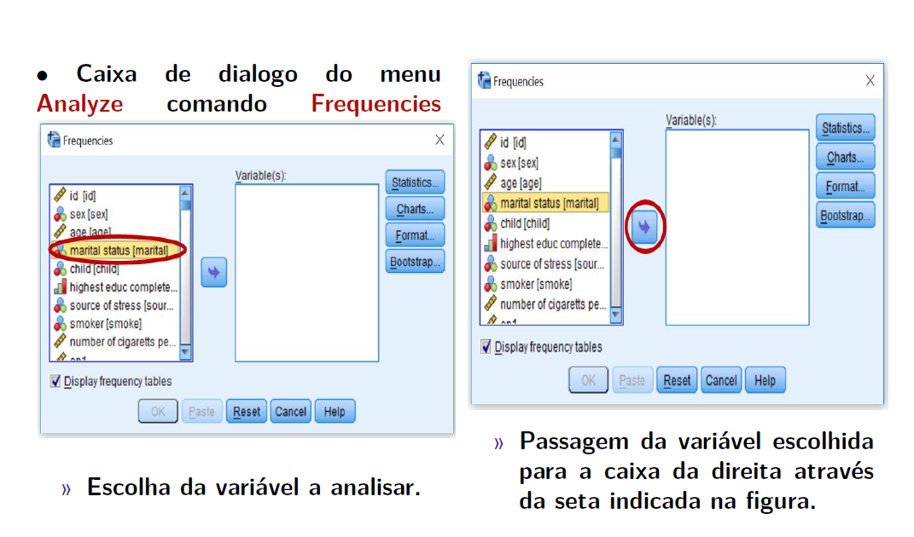

layout: true
  
<div class="my-footer"><span>

<a href=https://antoniorungo.com/">antoniorungo.com</a> - Email: <a href="tony.niquisse@gmail.com">tony.niquisse@gmail.com</a>
</span></div>

<style type="text/css">
.remark-slide-content {
    font-size: 24px;
    <!--padding: 1em 4em 1em 4em;-->
}
</style>


---
class: inverse, middle
background-color: #fafaf3
text-color: white
.header[]

### 


```{r, work_flow, fig.show="hold", out.width="100%", echo=FALSE, warning=FALSE,message=FALSE}
knitr::include_graphics("img/fig1.PNG")

# knitr::include_graphics("commcare.png")
# 
# knitr::include_graphics("dhis.png")
```


---
class: center

### 

```{r, echo=FALSE, out.width="100%", fig.cap="<center><b>  </b></center>"}

```

---
class: middle

### 

```{r, echo=FALSE, out.width="100%", fig.cap="<center><b>  </b></center>"}

```


---
class: middle

### 

```{r, echo=FALSE, out.width="100%", fig.cap="<center><b>  </b></center>"}

```


---
class: middle

### 

```{r, echo=FALSE, out.width="100%", fig.cap="<center><b>  </b></center>"}

```


---
class: middle 

### 


```{r, echo=FALSE, out.width="100%", fig.cap="<center><b>  </b></center>"}

```


---
class: middle 

### 


```{r, echo=FALSE, out.width="100%", fig.cap="<center><b>  </b></center>"}

```


---
class: middle


```{r, echo=FALSE, out.width="100%", fig.cap="<center><b>  </b></center>"}

```


---
class: middle

### 

```{r, echo=FALSE, out.width="100%", fig.cap="<center><b>  </b></center>"}

```


---
class: middle

### 

```{r, echo=FALSE, out.width="100%", fig.cap="<center><b>  </b></center>"}

```


---
class: middle

### 


```{r, echo=FALSE, out.width="100%",fig.align='center', fig.cap="<center><b>  </b></center>"}

```


---
class: middle

### 


```{r, echo=FALSE, out.width="100%",fig.align='center', fig.cap="<center><b>  </b></center>"}

```


---
class: middle

### 


```{r, echo=FALSE, out.width="100%",fig.align='center', fig.cap="<center><b>  </b></center>"}

```


---
class: middle

### 


```{r, echo=FALSE, out.width="100%",fig.align='center', fig.cap="<center><b>  </b></center>"}
knitr::include_graphics("img/fig14.PNG")
```


---
class: middle

###


```{r, echo=FALSE, out.width="100%",fig.align='center', fig.cap="<center><b>  </b></center>"}

```


---
class: middle


```{r, echo=FALSE, out.width="100%",fig.align='center', fig.cap="<center><b>  </b></center>"}

```


---
class: middle


```{r, echo=FALSE, out.width="100%",fig.align='center', fig.cap="<center><b>  </b></center>"}

```


---
class: middle


```{r, echo=FALSE, out.width="100%",fig.align='center', fig.cap="<center><b>  </b></center>"}

```


---
class: middle


```{r, echo=FALSE, out.width="100%",fig.align='center', fig.cap="<center><b>  </b></center>"}

```


---
class: middle


```{r, echo=FALSE, out.width="100%",fig.align='center', fig.cap="<center><b>  </b></center>"}

```


---
class: middle

### Como criar uma Variável


```{r, echo=FALSE, out.width="100%",fig.align='center', fig.cap="<center><b>  </b></center>"}

```


---
class: middle

### 

```{r, echo=FALSE, out.width="100%",fig.align='center', fig.cap="<center><b>  </b></center>"}

```


---
class: middle

### 

```{r, echo=FALSE, out.width="100%",fig.align='center', fig.cap="<center><b>  </b></center>"}

```


---
class: middle

### 

```{r, echo=FALSE, out.width="100%",fig.align='center', fig.cap="<center><b>  </b></center>"}

```

---
class: middle

### 

```{r, echo=FALSE, out.width="100%",fig.align='center', fig.cap="<center><b>  </b></center>"}
knitr::include_graphics("img/fig25.png")
```

---
class: middle

### 

```{r, echo=FALSE, out.width="100%",fig.align='center', fig.cap="<center><b>  </b></center>"}

```

---
class: middle

### 

```{r, echo=FALSE, out.width="100%",fig.align='center', fig.cap="<center><b>  </b></center>"}

```

---
class: middle

### 

```{r, echo=FALSE, out.width="100%",fig.align='center', fig.cap="<center><b>  </b></center>"}

```

---
class: middle

### 

```{r, echo=FALSE, out.width="100%",fig.align='center', fig.cap="<center><b>  </b></center>"}

```

---
class: middle

### 

```{r, echo=FALSE, out.width="100%",fig.align='center', fig.cap="<center><b>  </b></center>"}

```

---
class: middle

### 


```{r, echo=FALSE, out.width="100%",fig.align='center', fig.cap="<center><b>  </b></center>"}

```


---
class: middle

### 

```{r, echo=FALSE, out.width="100%",fig.align='center', fig.cap="<center><b>  </b></center>"}

```


---
class: middle

### 


```{r, echo=FALSE, out.width="100%",fig.align='center', fig.cap="<center><b>  </b></center>"}
knitr::include_graphics("img/fig33.png")
```


---
class: middle

### 

```{r, echo=FALSE, out.width="100%",fig.align='center', fig.cap="<center><b>  </b></center>"}

```

---
class: middle

### 

```{r, echo=FALSE, out.width="100%",fig.align='center', fig.cap="<center><b>  </b></center>"}

```

---
class: middle

### 

```{r, echo=FALSE, out.width="100%",fig.align='center', fig.cap="<center><b>  </b></center>"}

```

---
class: middle

### 

```{r, echo=FALSE, out.width="100%",fig.align='center', fig.cap="<center><b>  </b></center>"}

```

---
class: middle

### 

```{r, echo=FALSE, out.width="100%",fig.align='center', fig.cap="<center><b>  </b></center>"}

```

---
class: middle

### 

```{r, echo=FALSE, out.width="100%",fig.align='center', fig.cap="<center><b>  </b></center>"}

```

---
class: middle

### 

```{r, echo=FALSE, out.width="100%",fig.align='center', fig.cap="<center><b>  </b></center>"}

```

---
class: middle

### 

```{r, echo=FALSE, out.width="100%",fig.align='center', fig.cap="<center><b>  </b></center>"}

```


---
class: middle

### 

```{r, echo=FALSE, out.width="100%",fig.align='center', fig.cap="<center><b>  </b></center>"}

```


---
class: middle

### 


```{r, echo=FALSE, out.width="100%",fig.align='center', fig.cap="<center><b>  </b></center>"}

```


---
class: middle

### 

```{r, echo=FALSE, out.width="100%",fig.align='center', fig.cap="<center><b>  </b></center>"}

```

---
class: middle

### 

```{r, echo=FALSE, out.width="100%",fig.align='center', fig.cap="<center><b>  </b></center>"}

```

---
class: middle

### 

```{r, echo=FALSE, out.width="100%",fig.align='center', fig.cap="<center><b>  </b></center>"}

```

---
class: middle

### 

```{r, echo=FALSE, out.width="100%",fig.align='center', fig.cap="<center><b>  </b></center>"}

```

---
class: middle

### 

```{r, echo=FALSE, out.width="100%",fig.align='center', fig.cap="<center><b>  </b></center>"}

```

---
class: middle

### 

```{r, echo=FALSE, out.width="100%",fig.align='center', fig.cap="<center><b>  </b></center>"}

```

---
class: middle

### 

```{r, echo=FALSE, out.width="100%",fig.align='center', fig.cap="<center><b>  </b></center>"}

```

---
class: middle

### 

```{r, echo=FALSE, out.width="100%",fig.align='center', fig.cap="<center><b>  </b></center>"}

```

---
class: middle

### 


```{r, echo=FALSE, out.width="100%",fig.align='center', fig.cap="<center><b>  </b></center>"}

```


---
class: middle

### 


```{r, echo=FALSE, out.width="100%",fig.align='center', fig.cap="<center><b>  </b></center>"}
knitr::include_graphics("img/fig53.png")
```


---
class: middle

### 

```{r, echo=FALSE, out.width="100%",fig.align='center', fig.cap="<center><b>  </b></center>"}

```

---
class: middle

### 

```{r, echo=FALSE, out.width="100%",fig.align='center', fig.cap="<center><b>  </b></center>"}

```


---
class: middle

### 

```{r, echo=FALSE, out.width="100%",fig.align='center', fig.cap="<center><b>  </b></center>"}
knitr::include_graphics("img/fig56.png")
```

---
class: middle

### 

```{r, echo=FALSE, out.width="100%",fig.align='center', fig.cap="<center><b>  </b></center>"}

```

---
class: middle

### 

```{r, echo=FALSE, out.width="100%",fig.align='center', fig.cap="<center><b>  </b></center>"}

```

---
class: middle

### 

```{r, echo=FALSE, out.width="100%",fig.align='center', fig.cap="<center><b>  </b></center>"}

```

---
class: middle

### 

```{r, echo=FALSE, out.width="100%",fig.align='center', fig.cap="<center><b>  </b></center>"}

```

---
class: middle

### 

```{r, echo=FALSE, out.width="100%",fig.align='center', fig.cap="<center><b>  </b></center>"}

```

---
class: middle

### 


```{r, echo=FALSE, out.width="100%",fig.align='center', fig.cap="<center><b>  </b></center>"}

```


---
class: middle

### 


```{r, echo=FALSE, out.width="100%",fig.align='center', fig.cap="<center><b>  </b></center>"}

```

---
class: middle

### 


```{r, echo=FALSE, out.width="100%",fig.align='center', fig.cap="<center><b>  </b></center>"}

```

---
class: middle

### 

```{r, echo=FALSE, out.width="100%",fig.align='center', fig.cap="<center><b>  </b></center>"}

```

---
class: middle

### 

```{r, echo=FALSE, out.width="100%",fig.align='center', fig.cap="<center><b>  </b></center>"}

```

---
class: middle

### 

```{r, echo=FALSE, out.width="100%",fig.align='center', fig.cap="<center><b>  </b></center>"}

```

---
class: middle

### 

```{r, echo=FALSE, out.width="100%",fig.align='center', fig.cap="<center><b>  </b></center>"}

```

---
class: middle

### 

```{r, echo=FALSE, out.width="100%",fig.align='center', fig.cap="<center><b>  </b></center>"}

```

---
class: middle

### 

```{r, echo=FALSE, out.width="100%",fig.align='center', fig.cap="<center><b>  </b></center>"}

```

---
class: middle

### 

```{r, echo=FALSE, out.width="100%",fig.align='center', fig.cap="<center><b>  </b></center>"}

```


---
class: middle

### 

```{r, echo=FALSE, out.width="100%",fig.align='center', fig.cap="<center><b>  </b></center>"}

```

---
class: middle

### 


```{r, echo=FALSE, out.width="100%",fig.align='center', fig.cap="<center><b>  </b></center>"}

```


---
class: middle

### 

```{r, echo=FALSE, out.width="100%",fig.align='center', fig.cap="<center><b>  </b></center>"}

```

---
class: middle

### 

```{r, echo=FALSE, out.width="100%",fig.align='center', fig.cap="<center><b>  </b></center>"}

```

---
class: middle

### 

```{r, echo=FALSE, out.width="100%",fig.align='center', fig.cap="<center><b>  </b></center>"}

```

---
class: middle

### 

```{r, echo=FALSE, out.width="100%",fig.align='center', fig.cap="<center><b>  </b></center>"}

```

---
class: middle

### 

```{r, echo=FALSE, out.width="100%",fig.align='center', fig.cap="<center><b>  </b></center>"}

```

---
class: middle

### 

```{r, echo=FALSE, out.width="100%",fig.align='center', fig.cap="<center><b>  </b></center>"}

```

---
class: middle

### 

```{r, echo=FALSE, out.width="100%",fig.align='center', fig.cap="<center><b>  </b></center>"}

```

---
class: middle

### 

```{r, echo=FALSE, out.width="100%",fig.align='center', fig.cap="<center><b>  </b></center>"}

```

---
class: middle

### 


```{r, echo=FALSE, out.width="100%",fig.align='center', fig.cap="<center><b>  </b></center>"}

```

---
class: middle

### 


```{r, echo=FALSE, out.width="100%",fig.align='center', fig.cap="<center><b>  </b></center>"}

```


---
class: middle

### 

```{r, echo=FALSE, out.width="100%",fig.align='center', fig.cap="<center><b>  </b></center>"}

```

---
class: middle

### 

```{r, echo=FALSE, out.width="100%",fig.align='center', fig.cap="<center><b>  </b></center>"}

```

---
class: middle

### 

```{r, echo=FALSE, out.width="100%",fig.align='center', fig.cap="<center><b>  </b></center>"}

```

---
class: middle

### 

```{r, echo=FALSE, out.width="100%",fig.align='center', fig.cap="<center><b>  </b></center>"}

```

---
class: middle

### 

```{r, echo=FALSE, out.width="100%",fig.align='center', fig.cap="<center><b>  </b></center>"}

```


<!-- --- -->
<!-- class: middle -->

<!-- ###  -->

<!-- ```{r, echo=FALSE, out.width="100%",fig.align='center', fig.cap="<center><b>  </b></center>"} -->
<!--  -->
<!-- ``` -->

<!-- --- -->
<!-- class: middle -->

<!-- ###  -->

<!-- ```{r, echo=FALSE, out.width="100%",fig.align='center', fig.cap="<center><b>  </b></center>"} -->
<!--  -->
<!-- ``` -->


